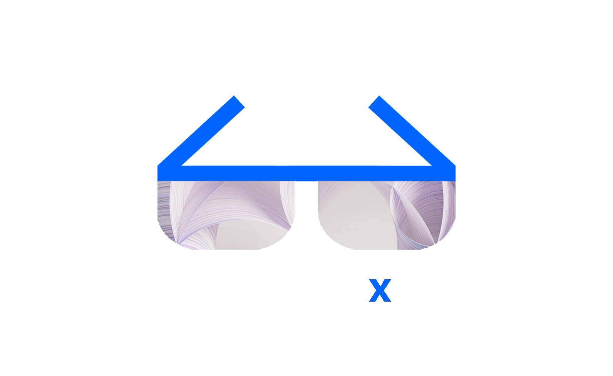

	 
	 
	

		<picture>
			<source media="(prefers-color-scheme: dark)" srcset="images/wx-3.png">
			
		</picture>
		 
	

	

		<a href="https://bam.res.ibm.com/">WatsonX AI</a> is an artificial intelligence developed by <a href="https://www.ibm.com/">IBM</a>
	

	 
	
	 
	 
	 
	 
	 

# Build Lab 

> WatsonX

## Contents

- [WatsonX](#watsonx)
- [WatsonX.ai](#watsonx.ai)
- [WatsonX.data](#watsonx.data)
- [WatsonX.governance](#watsonx.governance)

## WatsonX Overview

- [WatsonX Overview](https://www.ibm.com/watson)
- [WatsonX.ai Overview](https://www.ibm.com/products/watsonx-ai)
- [WatsonX.data Overview](https://www.ibm.com/products/watsonx-data)
- [WatsonX.governance Overview](https://www.ibm.com/products/watsonx-governance)

## WatsonX.ai - Learning Path

In this section, pass on what you have learned.
- [WatsonX Seismic](https://ibm.seismic.com/app?ContentId=7f7b6631-07a7-4349-a07c-ebf8d6e79ab2#/doccenter/861ea1fd-99e0-44d7-9135-85412e5c28d1/doc/%252Fdd3359e5f7-a856-a91b-7688-41024b2ac637%252FdfNTY4NmVhOWItY2RkNS04ZWY3LTZkNzItZTQwZjczMWUyMjk1%252CPT0%253D%252CRGF0YSBhbmQgQUk%253D%252FdfOthers%252FdfOTRiYmU4NTQtNWY4NC03Y2QyLWZjYWUtOGIxYmFmZjkyZThk%252CPT0%253D%252CU2FsZXMga2l0%252Flf300ba605-4692-43d9-bbef-68bde18a0fcd/grid/)

## WatsonX.data - Learning Path

## WatsonX.governance - Learning Path

### Documentation

- [YourLearning - IBM watsonx.data Level 2](https://yourlearning.ibm.com/activity/PLAN-96BA3950C94B)

## Contribute

Contributions welcome! Read the [contribution guidelines](contributing.md) first.
