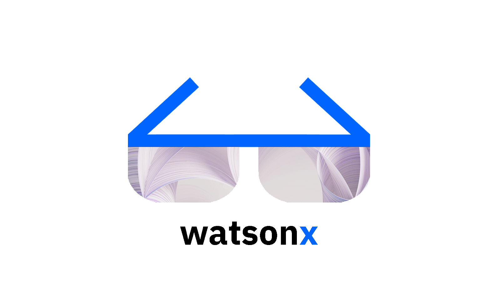

	 
	 
	

		<picture>
			<source media="(prefers-color-scheme: dark)" srcset="images/wx-3.png">
			
		</picture>
		 
	

	

		<a href="https://bam.res.ibm.com/">watsonx:</a> enterprise ready AI and data platform designed to multiply the impact of AI by <a href="https://www.ibm.com/">IBM</a>
	

	 
	
	 
	 
	 
	 
	 

# Build Lab Americas 

> Welcome! This page was made for you and by you - that’s right, with your collaboration we will help the entire Build Lab team with insights, materials and training regarding watsonx. Please join us and insert the best content on this page :slightly_smiling_face:

## Contents

- [watsonx.ai](#watsonx.ai)
- [watsonx.data](#watsonx.data)
- [watsonx.governance](#watsonx.governance)

## Overwiew

- [watsonx Seismic](https://ibm.seismic.com/app?ContentId=7f7b6631-07a7-4349-a07c-ebf8d6e79ab2#/doccenter/861ea1fd-99e0-44d7-9135-85412e5c28d1/doc/%252Fdd3359e5f7-a856-a91b-7688-41024b2ac637%252FdfNTY4NmVhOWItY2RkNS04ZWY3LTZkNzItZTQwZjczMWUyMjk1%252CPT0%253D%252CRGF0YSBhbmQgQUk%253D%252FdfOthers%252FdfOTRiYmU4NTQtNWY4NC03Y2QyLWZjYWUtOGIxYmFmZjkyZThk%252CPT0%253D%252CU2FsZXMga2l0%252Flf300ba605-4692-43d9-bbef-68bde18a0fcd/grid/)

## Target Timeline GA

	 
	

		<picture>
			<source media="(prefers-color-scheme: dark)" srcset="images/Screenshot 2023-06-28 at 15.38.49.png">
			
		</picture>
	

	 
	

		<picture>
			<source media="(prefers-color-scheme: dark)" srcset="images/cWatsonx.ai-wh.png">
			
		</picture>
	

### Engage
- Insert here the best material about how to engage the Business Partner.
  
- [Title](Link)(🚀)

### Design
- Insert here the best material about how to design the solution.

- [Title](Link)(🌟)

### Deploy
- Insert here the best material about how to deploy the solution.

- [Title](Link)(🚀)

	 
	

		<picture>
			<source media="(prefers-color-scheme: dark)" srcset="images/Watsonx.data-wh.png">
			
		</picture>
	

### Engage
- Insert here the best material about how to engage the Business Partner.
  
- [Title](Link)(🚀)

### Design
- Insert here the best material about how to design the solution.

- [Title](Link)(🌟)

### Deploy
- Insert here the best material about how to deploy the solution.

- [Title](Link)(🚀)
- 

	 
	

		<picture>
			<source media="(prefers-color-scheme: dark)" srcset="images/Watsonx.governance-wh.png">
			
		</picture>
	

### Engage
- Insert here the best material about how to engage the Business Partner.
  
- [Title](Link)(🚀)

### Design
- Insert here the best material about how to design the solution.

- [Title](Link)(🌟)

### Deploy
- Insert here the best material about how to deploy the solution.

- [Title](Link)(🚀)

### Documentation

- [Your Learning - IBM watsonx.data Level 2](https://yourlearning.ibm.com/activity/PLAN-96BA3950C94B)

## Contribute

Contributions welcome! Read the [contribution guidelines](contributing.md) first.
